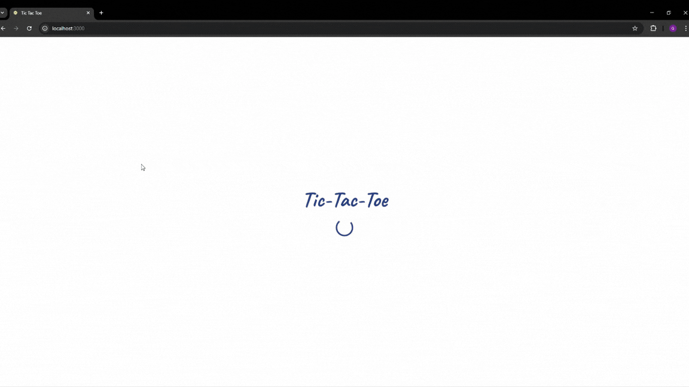

# Tic Tac Toe - Real-Time Multiplayer and Multi-Modal Game

Tic Tac Toe is a modern gaming application that offers multiple ways to enjoy the classic game. Developed using the MERN stack and powered by Socket.io, this project allows users to play quickly, intuitively, and in real time.

## 🎮 Game Showcase

Check out a quick look at the gameplay in AI Mode (tested on 'Slow 4G').

## ⚡ Main Features

- **Local 1 vs 1:**
  Enjoy head-to-head matches on the same device—perfect for a quick game with family or friends.

- **AI Mode:**
  Challenge the computer locally with an AI opponent that uses the minimax algorithm for a fair and stimulating game. It offers 3 difficulty levels (easy, medium, and hard).

- **No Registration Multiplayer:**
  Play online without the need to sign up. Simply connect and enjoy real-time matches.

- **Saved Games with Account Registration:**
  Prefer to keep track of your progress and statistics? Create an account to save your games and monitor your improvement over time.

- **Customizable Experience:**
  Adjust game settings to your preference, including options to mute sounds and enable dark mode for a better visual experience.

- **Flexible Multiplayer Options:**
  - **Invite via Code:** Generate a unique code to invite a friend and enjoy a custom match.
  - **Matchmaking:** Set the desired number of wins, and the system will match you with an opponent aiming for the same goal.

## 🛠️ Technologies Used

- **Frontend:** Vite, React.Js, Tailwind CSS
- **Backend:** Node.js, Express.js, MongoDB, Socket.io
- **Authentication:** Passport.js, bcryptjs, JWT
- **Real-Time Communication:** WebSockets (Socket.io)

## 🕹️ Play now

With Tic Tac Toe, fun and challenge are just a click away, providing an adaptable experience for both casual games and intense competitions. Get ready to play and showcase your strategic skills with every move! [Try it out.](https://tic-tac-toe-6zcv.onrender.com/)